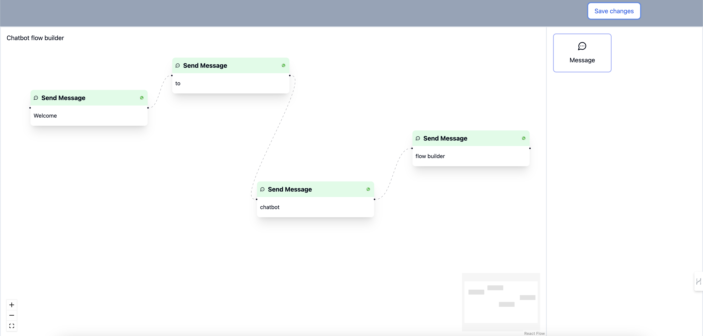
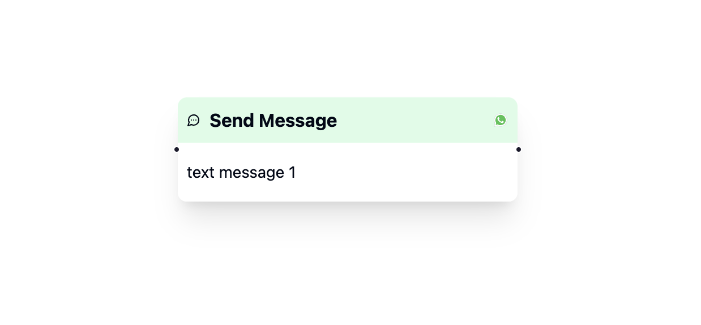
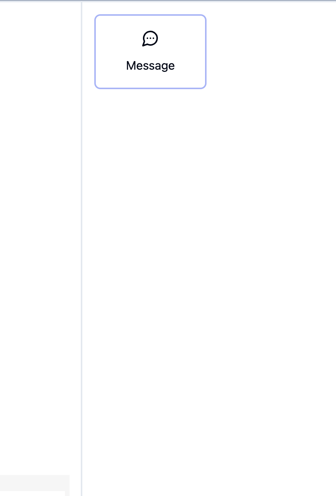
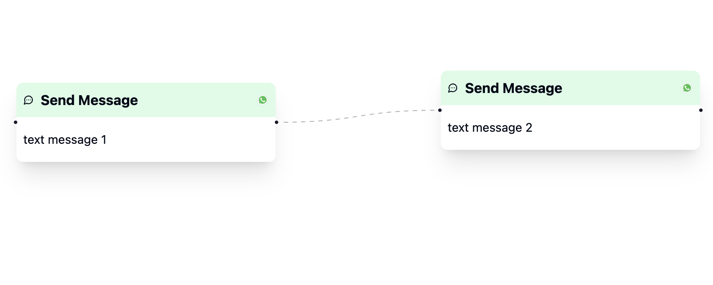
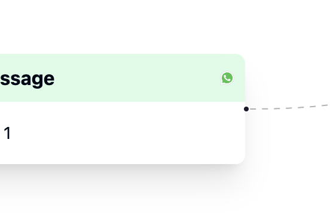
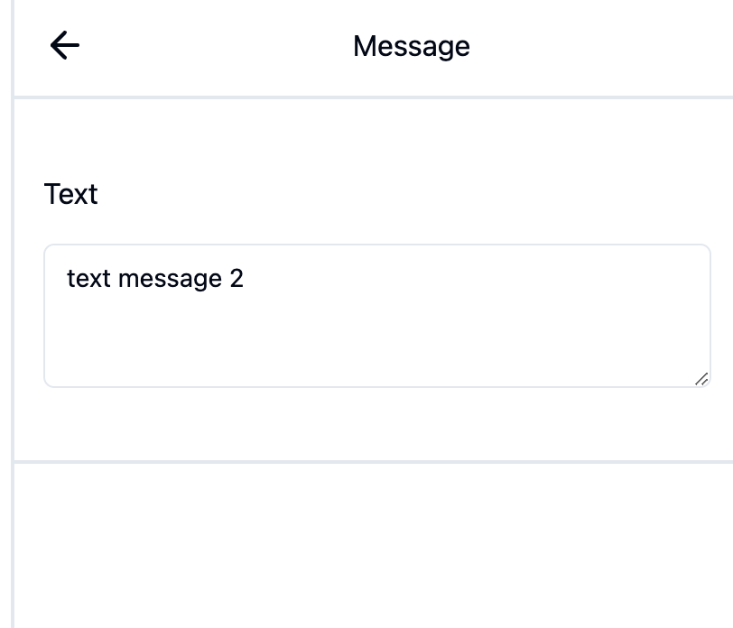

# BiteSpeed Chatbot Flow Builder

## Overview

The BiteSpeed Chatbot Flow Builder is a simple, extensible tool built using React for designing chatbot conversation flows. A chatbot flow is created by connecting multiple message nodes to determine the sequence of interactions.

## Live Link

[chatbot flow builder](https://chatbot-flow-builder-bay.vercel.app/)

## Features

1. **Text Node**

   - The flow builder supports only Text Messages at the moment.
   - Multiple Text Nodes can be included in a single flow.
   - Nodes are added by dragging and dropping from the Nodes Panel.
     

2. **Nodes Panel**

   - Contains all types of nodes supported by the flow builder.
   - Currently, only the Message Node is available, but the design allows for future extensions.
     

3. **Edge**

   - Connects two nodes together, representing the flow of the conversation.
     

4. **Source Handle**

   - The starting point of a connecting edge.
   - Only one edge can originate from a source handle.
     

5. **Target Handle**

   - The endpoint of a connecting edge.
   - Can have multiple edges connected to a single target handle.
     

6. **Settings Panel**

   - Replaces the Nodes Panel when a node is selected.
   - Includes a text field for editing the text of the selected Text Node.
     

7. **Save Button**
   - Saves the flow.
   - Displays an error if there are multiple nodes with empty target handles.

## Usage

- **Adding Nodes:** Drag and drop nodes from the Nodes Panel to the flow canvas.
- **Connecting Nodes:** Use the source and target handles to draw edges between nodes.
- **Editing Nodes:** Click on a node to open the Settings Panel and edit the text content.
- **Saving the Flow:** Click the Save button to save the flow. Ensure all nodes are properly connected to avoid errors.

## Extensibility

The project is designed to be easily extensible. Future enhancements can include:

- Additional node types
- Custom edge styles
- Advanced validation rules

## Libraries Used

- [React](https://reactjs.org/)
- [React Flow](https://reactflow.dev/)

## Contact

For any questions or support, please contact [starlove54](mailto:anubhavnegi54@gmail.com).

---

**Note:**

- [React Flow](https://reactflow.dev/) was used to build this project.
